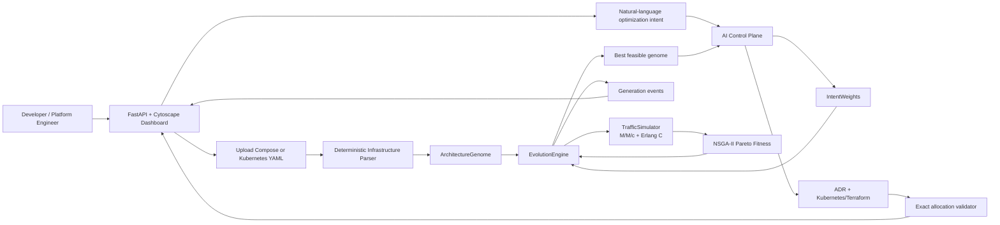

# EvoArch

**EvoArch is an AI-assisted, mathematics-first reliability and cost optimizer for microservice architectures.** It ingests a Docker Compose or Kubernetes topology, models queueing behavior with M/M/c and Erlang C, evolves a Pareto-optimal topology with NSGA-II, streams the run live to a FastAPI/Cytoscape dashboard, and can generate a validated Kubernetes deployment package with an Architectural Decision Record (ADR).

> EvoArch is a design-time decision-support tool. It uses an analytic queueing model and simplified resource pricing; it is not a replacement for production load testing, observability, security review, or deployment approval.

## Contents

- [Capabilities](#capabilities)
- [Architecture](#architecture)
- [Quick Start](#quick-start)
- [Using the Dashboard](#using-the-dashboard)
- [Topology Ingestion](#topology-ingestion)
- [Mathematical Model](#mathematical-model)
- [Evolutionary Optimizer](#evolutionary-optimizer)
- [Chaos Mode](#chaos-mode)
- [AI Control Plane](#ai-control-plane)
- [API Reference](#api-reference)
- [WebSocket Event Stream](#websocket-event-stream)
- [Python API](#python-api)
- [Deployment Artifact Validation](#deployment-artifact-validation)
- [Configuration](#configuration)
- [Project Layout](#project-layout)
- [Operational Limits and Assumptions](#operational-limits-and-assumptions)
- [Troubleshooting](#troubleshooting)
- [Validation and Development](#validation-and-development)

## Capabilities

| Area | What EvoArch does |
| --- | --- |
| Topology DNA | Represents services, dependencies, replicas, CPU, memory, and routing as strict Pydantic v2 models. |
| Traffic simulation | Propagates request load through an acyclic dependency graph and estimates service and critical-path P99 latency with M/M/c + Erlang C. |
| Cost model | Computes a transparent hourly compute estimate from replica count, CPU, and memory allocations. |
| Multi-objective search | Uses feasibility-first NSGA-II non-dominated sorting and crowding distance to balance latency and spend. |
| Evolution | Runs concurrent population simulation with elitism, tournament selection, crossover, and targeted mutations. |
| Chaos Mode | Removes one replica from a shared random 10–20% service sample per generation to reward fault-tolerant candidates. |
| Infrastructure ingestion | Deterministically parses Docker Compose and Kubernetes YAML into an `ArchitectureGenome`; no model call is required for dashboard uploads. |
| AI control plane | Converts developer intent into bounded fitness weights and produces an ADR plus validated Kubernetes or Terraform artifacts. |
| Live observability | Streams events over WebSocket to a high-density Cytoscape workstation with utilization heatmaps and dynamic edge-latency labels. |

## Architecture



### Run lifecycle

1. A user optionally uploads a `.yaml` or `.yml` topology file.
2. The deterministic parser creates and validates an `ArchitectureGenome`; the dashboard immediately redraws the dependency graph.
3. The user enters a natural-language objective and starts a run.
4. The AI control plane returns four constrained tuning variables: latency weight, cost weight, maximum replicas, and traffic multiplier.
5. EvoArch builds a varied initial population, evaluates it in parallel, ranks it with NSGA-II, and produces a new generation.
6. The dashboard receives `generation_complete` events containing metrics, utilization, saturated services, and topology layout data.
7. After the final generation, the AI control plane synthesizes an ADR and IaC. EvoArch validates it against the selected genome before publishing it.

## Quick Start

### Prerequisites

- Python **3.10+** (Python 3.12 is a good choice)
- A Gemini API key for the default AI-enabled workflow
- Optional: an OpenAI API key if using the direct OpenAI provider instead

The frontend loads Tailwind CSS and Cytoscape.js from CDNs, so no Node.js install is required to run the dashboard.

### 1. Create and activate a virtual environment

```bash
cd /Users/laksharajjha/Documents/EvoArch
python3 -m venv .venv
source .venv/bin/activate
```

On Windows PowerShell:

```powershell
py -m venv .venv
.venv\Scripts\Activate.ps1
```

### 2. Install Python dependencies

```bash
python -m pip install --upgrade pip
python -m pip install -r requirements.txt
```

### 3. Configure credentials

```bash
cp .env.example .env
```

Edit `.env` and add a real key. Do not commit this file; `.gitignore` already excludes it.

```dotenv
GEMINI_API_KEY=your-gemini-api-key
EVOARCH_AI_PROVIDER=gemini
EVOARCH_GEMINI_MODEL=gemini-3.1-flash-lite
```

### 4. Start the dashboard

```bash
uvicorn evoarch.visualization.dashboard:app --reload --port 8000
```

Open [http://localhost:8000](http://localhost:8000).

### 5. Run a first optimization

Use the default seven-service baseline or upload the included enterprise example:

```text
evoarch-enterprise-stack.yaml
```

Then enter an intent such as:

```text
Prepare this architecture for Black Friday traffic. Prioritize P99 latency and resilience over cloud cost.
```

Enable **Chaos Mode** if you want EvoArch to optimize under injected single-replica failures.

## Using the Dashboard

The dashboard is a single-page FastAPI response at `/`, backed by a WebSocket stream at `/ws/stream`.

### Header control plane

- **Intent prompt**: natural-language request sent to the AI control plane.
- **Ingest YAML**: imports Docker Compose or Kubernetes YAML as the new baseline.
- **Chaos Mode**: causes population evaluations to run under a shared service-failure scenario.
- **Trigger Autonomous Optimization**: translates the intent, then starts a background worker.

### Metric strip

| Metric | Meaning |
| --- | --- |
| `LATENCY (P99)` | Critical-path P99 latency. It becomes `∞` when a simulated queue is saturated. |
| `COST/HR (USD)` | Transparent estimated hourly compute cost for the selected architecture. |
| `ACTIVE_NODES` | Number of services in the current topology. |
| `GEN_EFFICIENCY` | Composite dashboard score. Pareto rank remains the selection authority. |

### Network Fabric

The Cytoscape view updates after topology ingestion and every completed generation.

- **Green nodes**: stable/optimized services below the saturation threshold.
- **Amber nodes**: services changed between selected generations.
- **Red-to-maroon nodes**: rising utilization or queue saturation; the heatmap intensifies as utilization approaches or exceeds capacity.
- **Dynamic edge labels**: base network latency plus estimated target queue wait. `SAT` denotes no finite queue wait because the target is saturated.
- **Node metadata**: topology elements carry replica count, CPU limit, memory, routing algorithm, arrival rate, available replicas, and utilization ratio.

### System Console

- **STDIN/STDOUT AUDIT** streams intent translation, generation summaries, saturation warnings, and artifact status.
- **INFRASTRUCTURE SYNTHESIS** shows the validated ADR and generated IaC.
- **Copy** copies the current artifact to the clipboard, with a browser fallback for restrictive clipboard environments.
- **Download** writes the current artifact as `evoarch.optimized.yaml` or `evoarch.optimized.tf`.

## Topology Ingestion

`POST /api/upload-topology` accepts UTF-8 `.yaml` and `.yml` files up to **1 MB**. The dashboard uses the deterministic parser in `evoarch/api/infrastructure_parser.py`; uploads do not consume AI tokens.

### Docker Compose extraction

The parser reads:

- `services.<name>.deploy.replicas`
- `services.<name>.deploy.resources.limits.cpus`
- `services.<name>.deploy.resources.limits.memory`
- `depends_on`
- `links`
- environment values that reference another declared service
- routing labels: `evoarch.io/routing-algorithm`, `routing_algorithm`, or `routing`

### Kubernetes extraction

The parser recognizes workloads of kind:

- `Deployment`
- `StatefulSet`
- `DaemonSet`
- `Job`
- `CronJob`
- `Service`

For workloads, it aggregates declared container limits, reads replicas when applicable, and inspects literal container environment values for references to declared services. A standalone Kubernetes `Service` receives default resources when no matching workload exists.

### Defaults and safety rules

| Value | Default / behavior |
| --- | --- |
| Replicas | `1`, clamped to `1..20` |
| CPU | `0.5` cores, clamped to `0.1..4.0` |
| Memory | `512` MB, clamped to `128..8192` MB |
| Routing | `round_robin` |
| Inferred edge latency | `2.0 ms` |
| Duplicate/self edges | Ignored |
| Cycles in inferred edges | Skipped so the resulting topology remains acyclic |

> The parser identifies explicit deployment relationships; it does not infer calls merely because two services share a network.

## Mathematical Model

### Service genome

Every candidate is an `ArchitectureGenome`:

```python
ArchitectureGenome(
    services={
        "api": ServiceGene(
            service_name="api",
            replicas=3,
            cpu_limit=1.0,
            mem_limit_mb=1024,
            routing_algorithm="round_robin",
        ),
    },
    edges=[EdgeGene(source="api", target="worker", base_latency_ms=2.0)],
)
```

`ServiceGene` and `EdgeGene` reject unknown fields, non-finite numeric values, invalid references, blank names, and allocations outside the bounds below.

| Field | Valid range / values |
| --- | --- |
| `replicas` | Integer `1..20` |
| `cpu_limit` | Float `0.1..4.0` cores |
| `mem_limit_mb` | Integer `128..8192` MB |
| `routing_algorithm` | `round_robin`, `least_connections`, `random` |
| `base_latency_ms` | Finite non-negative float |

### Traffic propagation

The topology must be a directed acyclic graph (DAG). All root services—services without incoming edges—receive `baseline_qps`. EvoArch walks the graph in topological order and adds the source arrival rate to each target for every outgoing edge.

This models synchronous dependency calls with full request propagation. It is intentionally simple and deterministic: there are no call probabilities, cache-hit ratios, retries, traffic splitting, or asynchronous queue semantics in the baseline model.

### M/M/c queueing model

For each service:

- Arrival rate: `λ` is the propagated QPS.
- Service rate per replica: `μ = cpu_limit × 100 QPS/core` by default.
- Servers: `c` is the available replica count.
- Capacity: `c × μ`.
- Utilization: `ρ = λ / (c × μ)`.

If `ρ ≥ 1`, the steady-state queue has no finite P99. EvoArch marks the service saturated and returns `None` for its P99 value.

For stable services, EvoArch computes Erlang C—the probability an arrival must wait—and solves the response-time CDF for the 99th percentile by bounded bisection. The aggregate latency is the slowest root-to-service path, including every traversed service P99 and base network edge latency.

### Cost model

The hourly cost estimate is deliberately transparent:

```text
hourly_cost = Σ replicas × ((cpu_limit × 0.04) + ((mem_limit_mb / 1024) × 0.01))
```

The price constants are model parameters, not a live cloud-provider quote:

- CPU: `$0.04` per core-hour
- Memory: `$0.01` per GiB-hour

### Fitness and constraints

NSGA-II minimizes two objectives:

1. `total_p99_latency_ms`
2. `total_cost_hourly`

Saturation is treated as a feasibility violation before normal Pareto comparison. A feasible architecture dominates an overloaded one; when both are overloaded, lower aggregate overload wins before cost is considered.

The dashboard also exposes a scalar convenience score:

```text
F = 1000 / (latency_weight × P99 + cost_weight × cost + structural_penalties)
```

Default weights are `0.7` latency and `0.3` cost. A saturated queue adds a `10,000` structural penalty; a failed simulation adds `100,000`. The scalar is for visual sorting only—the NSGA-II front rank and crowding distance control parent selection.

## Evolutionary Optimizer

`EvolutionEngine` evaluates each population in a `ThreadPoolExecutor`, preserving population order after futures complete. It uses a seeded `random.Random` instance when a `random_seed` is supplied.

### Selection

1. Sort candidates by Pareto front rank.
2. Prefer larger crowding distance to retain architectural diversity.
3. Break ties with composite fitness, finite P99, and original index.
4. Use tournament selection to choose parents.
5. Carry top candidates into the next generation through elitism.

### Crossover

Crossover selects one parent as the base topology, retains its edges, and blends matching service genes with the other parent:

- replicas: rounded average, clamped to the intent-derived cap
- CPU: arithmetic average, clamped to schema bounds
- memory: rounded average, clamped to schema bounds
- routing: selected from one parent

### Mutation strategies

| Strategy | Effect |
| --- | --- |
| `scale_replicas` | Adjusts one service by one replica while preserving bounds. |
| `adjust_resources` | Changes CPU by `±0.25` and memory by `±256 MB`. |
| `toggle_routing` | Switches one service to another supported routing algorithm. |
| `break_bottleneck` | Targets a saturated/high-utilization service; increases replicas or CPU toward a target utilization of `0.85`. |

The dashboard seeds the initial population with the baseline plus distributed mutations so generation one is not homogeneous.

## Chaos Mode

Chaos Mode is a reliability objective, not a cosmetic visualization toggle.

For each generation, EvoArch samples a shared random **10–20%** set of services. Every candidate in that generation is evaluated under the same scenario for a fair comparison. Each selected service loses one available replica:

- a single-replica service becomes unavailable (`0` capacity)
- a multi-replica service continues with reduced capacity
- loss of finite queueing behavior yields saturation and unbounded P99

The optimizer’s feasibility-first ranking and `break_bottleneck` mutation then favor redundancy and headroom. When Chaos Mode is enabled, AI-generated Kubernetes packages must also include:

- `policy/v1` `PodDisruptionBudget`
- Istio `DestinationRule`
- Istio `VirtualService`
- liveness and readiness probes on port `8080`
- a concise ADR section titled `## Chaos Mitigation Strategy`

## AI Control Plane

`EvoArchAIAgent` uses the official OpenAI Python SDK for two provider modes:

| Provider | Credential | Transport |
| --- | --- | --- |
| Gemini (default when configured) | `GEMINI_API_KEY` | Gemini OpenAI-compatible endpoint |
| Direct OpenAI | `OPENAI_API_KEY` | OpenAI Responses API |

### Intent translation

`translate_intent_to_weights()` turns human intent into this strict schema:

```json
{
  "latency_weight": 0.8,
  "cost_weight": 0.2,
  "max_replicas_cap": 16,
  "load_intensity_multiplier": 5.0
}
```

Validation guarantees:

- both weights are in `0..1`
- the weights sum to exactly `1.0` within tolerance
- replica cap is in `1..20`
- load multiplier is in `0.1..10.0`

For Gemini, EvoArch attempts Pydantic-aware schema parsing first. It retains a JSON-object completion and extraction/repair path for compatibility with models that return prose or fenced JSON.

### Deployment synthesis

`generate_deployment_package()` first validates the optimized genome, then derives canonical service specs including Kubernetes-safe resource names, exact replicas, CPU millicores, memory, and routing data.

The model produces:

```json
{
  "adr_markdown": "# EvoArch Architecture Decision Record\n...",
  "iac_code": "apiVersion: apps/v1\nkind: Deployment\n..."
}
```

For Gemini deployment synthesis, configured models can run concurrently and EvoArch returns the first package that passes validation. With the default configuration, the duplicated primary/fallback model de-duplicates to a single request. Set `EVOARCH_GEMINI_DEPLOYMENT_MODELS` to a comma-separated list only when you intentionally want parallel model attempts.

The artifact output budget grows with topology size:

```text
max_output_tokens = clamp(6000 + 900 × service_count + chaos_bonus, 8000, 32000)
chaos_bonus = 2000 when Chaos Mode is enabled
```

This protects large topologies from consuming the ADR budget before their IaC is complete.

## API Reference

### `GET /`

Returns the dashboard HTML.

### `GET /api/status`

Returns the active run identifier, or `null` when idle.

```json
{
  "active_run_id": null
}
```

### `POST /api/run-optimization`

Translates the intent, validates its optimization weights, and schedules a single background optimization run. A second run while one is active returns `409 Conflict`.

```bash
curl -X POST http://localhost:8000/api/run-optimization \
  -H 'Content-Type: application/json' \
  -d '{
    "user_prompt": "Prepare for peak traffic and protect P99 latency.",
    "generation_count": 18,
    "population_size": 24,
    "baseline_qps": 120,
    "generation_delay_ms": 350,
    "random_seed": 42,
    "chaos_mode": true
  }'
```

| Request field | Default | Bounds / notes |
| --- | ---: | --- |
| `user_prompt` | — | Required, 1–4,000 characters |
| `generation_count` | `18` | `1..200` |
| `population_size` | `24` | `4..128` |
| `baseline_qps` | `120` | `>0..100000` |
| `generation_delay_ms` | `350` | `0..5000`; only controls dashboard pacing |
| `random_seed` | `null` | Optional integer for reproducible mutation/chaos sampling |
| `chaos_mode` | `false` | Boolean |

Successful response (`202 Accepted`):

```json
{
  "run_id": "a9f4d7...",
  "status": "started"
}
```

### `POST /api/upload-topology`

Uploads a Docker Compose or Kubernetes topology. The endpoint accepts multipart form data, `.yaml`/`.yml` files only, UTF-8 content, and a maximum size of 1 MB.

```bash
curl -X POST http://localhost:8000/api/upload-topology \
  -F 'file=@evoarch-enterprise-stack.yaml'
```

Successful response:

```json
{
  "status": "ingested",
  "source_file": "evoarch-enterprise-stack.yaml",
  "service_count": 15,
  "edge_count": 46
}
```

The exact service and edge counts depend on the uploaded file.

## WebSocket Event Stream

Connect to:

```text
ws://localhost:8000/ws/stream
```

The browser keeps the socket alive with periodic `ping` messages. EvoArch retains the most recent 250 events and replays them when a client reconnects.

| Event | Purpose | Important fields |
| --- | --- | --- |
| `topology_ingested` | Replaces the baseline graph after upload. | `layout`, `logs` |
| `intent_translated` | Shows the AI-derived math controls. | `intent_weights`, `chaos_mode`, `logs` |
| `run_started` | Announces workload and initial baseline layout. | `run_id`, `layout`, `generation` |
| `generation_complete` | One evaluated evolutionary generation. | `layout`, `metrics`, `logs`, `generation` |
| `artifact_synthesis_started` | Activates the IaC generation state. | `layout`, `metrics`, `logs` |
| `run_complete` | Publishes the validated ADR and IaC. | `adr_markdown`, `iac_code`, `target_format` |
| `run_failed` | Reports a controlled worker failure. | `logs` |

### Layout element contract

Each `layout` entry is a Cytoscape element. Nodes include `replicas`, `cpu_limit`, `memory_mb`, `arrival_rate_qps`, `available_replicas`, `utilization_ratio`, and `status`. Edges include `base_latency_ms`, `dynamic_latency_ms`, and `active`.

## Python API

### Simulate a genome

```python
from evoarch.models.genome import ArchitectureGenome, EdgeGene, ServiceGene
from evoarch.simulation.traffic import TrafficSimulator

genome = ArchitectureGenome(
    services={
        "api": ServiceGene(
            service_name="api",
            replicas=3,
            cpu_limit=1.0,
            mem_limit_mb=1024,
            routing_algorithm="round_robin",
        ),
        "worker": ServiceGene(
            service_name="worker",
            replicas=2,
            cpu_limit=0.5,
            mem_limit_mb=512,
            routing_algorithm="least_connections",
        ),
    },
    edges=[EdgeGene(source="api", target="worker", base_latency_ms=2.0)],
)

result = TrafficSimulator().simulate_load(genome, baseline_qps=80.0)
print(result["total_p99_latency_ms"])
print(result["total_cost_hourly"])
print(result["queue_saturation"])
```

### Rank a population

```python
from evoarch.optimizer.fitness import calculate_pareto_fitness
from evoarch.simulation.traffic import TrafficSimulator

records = calculate_pareto_fitness(
    genomes=[genome],
    simulator=TrafficSimulator(),
    baseline_qps=80.0,
    latency_weight=0.7,
    cost_weight=0.3,
)

print(records[0]["front_rank"])
print(records[0]["crowding_distance"])
```

### Advance one generation

```python
from evoarch.engine.evolution import EvolutionEngine
from evoarch.simulation.traffic import TrafficSimulator

engine = EvolutionEngine(
    TrafficSimulator(),
    baseline_qps=80.0,
    random_seed=42,
    latency_weight=0.8,
    cost_weight=0.2,
    max_replicas_cap=12,
    chaos_mode=True,
)

next_population = engine.run_generation([genome.model_copy(deep=True) for _ in range(8)])
best_record = min(engine.last_fitness, key=lambda record: record["front_rank"])
```

### Parse infrastructure locally

```python
from pathlib import Path

from evoarch.api.infrastructure_parser import parse_infrastructure_to_genome

content = Path("evoarch-enterprise-stack.yaml").read_text(encoding="utf-8")
genome = parse_infrastructure_to_genome(content)
print(genome.model_dump(mode="json"))
```

### Call the AI agent

```python
import asyncio

from evoarch.api.ai_agent import EvoArchAIAgent


async def main() -> None:
    agent = EvoArchAIAgent()
    try:
        weights = await agent.translate_intent_to_weights(
            "Prioritize latency during a high-traffic launch.",
            chaos_mode=True,
        )
        print(weights)
    finally:
        await agent.close()


asyncio.run(main())
```

## Deployment Artifact Validation

EvoArch does not blindly display the first model response. Before a generated package reaches the dashboard, it validates both the ADR and IaC against the optimized genome.

### ADR contract

The ADR must begin with a Markdown heading and include exact headers on their own lines:

```markdown
## Context
## Decision
## Mathematical Rationale
## Consequences
```

Chaos Mode additionally requires:

```markdown
## Chaos Mitigation Strategy
```

The prompt requires one or two concise bullets per section to reserve output capacity for large topology manifests.

### Kubernetes contract

For each canonical service resource name, Kubernetes output must contain exactly:

- one `apps/v1` `Deployment`
- one `v1` `Service`
- matching `app` selectors
- port and target port `8080`
- exact `replicas`
- exact CPU requests and limits
- exact memory requests and limits

`metadata.name` is constrained to canonical resource names. EvoArch also performs a narrow repair for recognizable `-deployment` and `-service` suffixes before strict validation.

### Terraform contract

Terraform output must contain matching `kubernetes_deployment_v1` and `kubernetes_service_v1` resources with the requested replicas, CPU, and memory allocations.

### Correction behavior

When a syntactically parseable package fails deterministic validation, the agent supplies the validation error and previous IaC to one correction attempt. If all configured model attempts fail validation, the dashboard emits `run_failed` instead of publishing unverified artifacts.

## Configuration

Copy `.env.example` to `.env` and configure only the variables you need.

| Variable | Purpose | Default |
| --- | --- | --- |
| `GEMINI_API_KEY` | Gemini credential; its presence selects Gemini automatically. | unset |
| `OPENAI_API_KEY` | Direct OpenAI credential, used only when Gemini is not selected. | unset |
| `EVOARCH_AI_PROVIDER` | Explicit provider: `gemini` or `openai`. | auto-detect |
| `EVOARCH_GEMINI_MODEL` | Primary Gemini model. | `gemini-3.1-flash-lite` |
| `EVOARCH_GEMINI_INTENT_FALLBACK_MODEL` | Intent fallback after schema failure. | `gemini-3.1-flash-lite` |
| `EVOARCH_GEMINI_DEPLOYMENT_FALLBACK_MODEL` | Artifact-generation fallback. | `gemini-3.1-flash-lite` |
| `EVOARCH_GEMINI_DEPLOYMENT_MODELS` | Optional comma-separated models to race for a validated artifact. | unset |
| `EVOARCH_OPENAI_MODEL` | Direct OpenAI model override. | `gpt-5.6-terra` in code |

Provider selection is resolved when an `EvoArchAIAgent` is created. Restart Uvicorn after changing `.env` if `--reload` does not detect the configuration change.

## Project Layout

```text
EvoArch/
├── .env.example                         # Safe environment-variable template
├── evoarch-enterprise-stack.yaml        # Larger topology example for ingestion
├── evoarch/
│   ├── api/
│   │   ├── ai_agent.py                  # Intent translation and artifact generation
│   │   └── infrastructure_parser.py     # Deterministic Compose/Kubernetes parser
│   ├── engine/
│   │   └── evolution.py                 # Parallel GA / NSGA-II execution loop
│   ├── models/
│   │   └── genome.py                    # Strict ArchitectureGenome Pydantic models
│   ├── optimizer/
│   │   └── fitness.py                   # Pareto fronts, penalties, crowding distance
│   ├── simulation/
│   │   └── traffic.py                   # M/M/c, Erlang C, P99, cost, Chaos Mode
│   └── visualization/
│       ├── dashboard.py                 # FastAPI routes, worker, WebSocket events
│       └── templates/index.html         # Tailwind/Cytoscape developer workstation
└── README.md
```

## Operational Limits and Assumptions

### Modeling assumptions

- The traffic model requires a DAG. Hand-authored cyclic graphs fail simulation; parser-inferred cyclic candidates are omitted.
- All root nodes receive the same external `baseline_qps`.
- Every outgoing edge receives the full arrival rate of its source. This is a synchronous fan-out approximation.
- Service rate is linearly proportional to CPU using the configurable `100 QPS/core` calibration in `TrafficSimulator`.
- Pricing is static and intentionally provider-agnostic.
- Routing algorithm is a genome variable and a deployment attribute, but it does not currently alter the M/M/c equations.
- Memory affects cost and generated manifests; it does not change the service-rate formula.

### Control-plane assumptions

- The dashboard stores state, event history, and active-run tracking in process memory. Use one Uvicorn worker for the current implementation.
- Only one optimization run can execute at a time per process.
- Large AI artifacts can still fail because of upstream quota, safety, schema, or model-quality issues. EvoArch surfaces the failure and does not publish a package that fails its deterministic contract.
- Generated IaC must be reviewed, tested, policy-checked, and applied through your normal delivery process.

### Security guidance

- Never place real API keys in source code, screenshots, issue trackers, or public repositories.
- Keep `.env` private; it is ignored by Git in this project.
- Run the local dashboard behind authentication before exposing it outside a trusted development environment.
- Treat uploaded topology content and generated IaC as untrusted until reviewed.

## Troubleshooting

### `502 Unable to translate optimization intent`

Likely causes:

- `GEMINI_API_KEY` or `OPENAI_API_KEY` is absent/invalid.
- The selected model is unavailable for the configured provider/account.
- The provider rejected a structured output request or exhausted quota.

Actions:

1. Confirm `.env` contains the intended key and provider/model variables.
2. Restart Uvicorn from the same shell or use `--reload`.
3. Try a concise intent such as: `Prioritize latency over cost for peak traffic.`
4. Check the audit console and server log for the controlled provider error.

### `409 an optimization run is already active`

Wait for the current run to complete or fail. The current dashboard intentionally permits one in-process worker at a time to keep live state and event history coherent.

### `422 Unable to parse a valid acyclic EvoArch topology`

Check that the upload:

- is UTF-8 YAML under 1 MB
- includes supported Compose/Kubernetes structures
- has valid resource quantities
- does not rely solely on an unsupported dependency notation

The parser will remove inferred cycle-forming edges, but a manually constructed cyclic genome cannot be simulated.

### Deployment package generation fails after evolution completes

This means the model response failed the deterministic ADR or IaC contract. The optimization result itself has completed; EvoArch refused to show an unvalidated artifact.

Actions:

1. Re-run after a transient model/provider failure.
2. For large topologies, retain the concise ADR requirements and avoid unnecessary model-output prose.
3. Configure a stronger deployment fallback model with `EVOARCH_GEMINI_DEPLOYMENT_FALLBACK_MODEL` or explicitly set `EVOARCH_GEMINI_DEPLOYMENT_MODELS`.
4. Review the server traceback—the final `DeploymentValidationError` identifies the exact unmet contract.

### The browser does not update

- Confirm the page is served from `http://localhost:8000`, not opened as a `file://` URL.
- Refresh the page to reconnect the WebSocket; the server replays recent events.
- Verify that no browser extension or proxy is blocking WebSocket connections.

## Validation and Development

Run a fast syntax check after modifying Python modules:

```bash
python -m py_compile \
  evoarch/models/genome.py \
  evoarch/simulation/traffic.py \
  evoarch/optimizer/fitness.py \
  evoarch/engine/evolution.py \
  evoarch/api/infrastructure_parser.py \
  evoarch/api/ai_agent.py \
  evoarch/visualization/dashboard.py
```

Run the server during UI development:

```bash
uvicorn evoarch.visualization.dashboard:app --reload --port 8000
```

Suggested manual smoke test:

1. Open the dashboard.
2. Upload `evoarch-enterprise-stack.yaml`.
3. Confirm the graph redraws and the audit console reports ingestion.
4. Run a latency-focused intent with Chaos Mode enabled.
5. Confirm generation events update the graph and metric strip.
6. Confirm the generated artifact appears in Infrastructure Synthesis.
7. Use **Copy** and **Download** only after the status shows the artifact is ready.

## License

No license file is currently included. Add an explicit license before distributing EvoArch outside its intended development or hackathon context.
