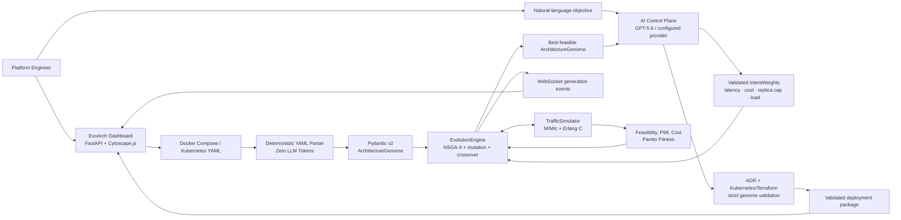

# EvoArch

> **An AI-assisted, mathematics-first reliability and cost optimizer for microservice architectures.**
>
> EvoArch is a design-time decision-support tool. It turns an infrastructure topology and a developer objective into a queueing-theory simulation, a Pareto-optimized architecture genome, and validated deployment guidance.

## Built End-to-End with Codex & GPT-5.6

EvoArch's architecture, mathematical models, and streaming backend were designed and coded **100% using Codex**. Codex built the system's core mathematical, evolutionary, parsing, API, and visualization layers—not merely the interface.

| Codex-built subsystem | What Codex implemented |
| --- | --- |
| Queueing engine | M/M/c service modeling, Erlang C waiting probabilities, P99 response-time estimation, saturation detection, and cost calculations. |
| Evolution engine | NSGA-II Pareto ranking, crowding distance, tournament selection, elitism, resource crossover, and bottleneck-targeted mutations. |
| Deterministic parser | Docker Compose and Kubernetes YAML extraction into a strict Pydantic v2 `ArchitectureGenome`, with **zero LLM token use** during dashboard ingestion. |
| Streaming control plane | Async FastAPI routes, WebSocket event streaming, per-session dashboard isolation, access gating, and rate limiting. |
| Operator dashboard | Cytoscape.js topology rendering, queue-saturation heatmaps, dynamic edge latency, audit logs, and validated IaC output. |

The AI Control Plane can use a direct **OpenAI/GPT-5.6** configuration (`gpt-5.6-terra` is the repository default) or Gemini through its OpenAI-compatible endpoint. Gemini is selected automatically when `GEMINI_API_KEY` is configured; set `EVOARCH_AI_PROVIDER=openai` to explicitly use the direct OpenAI path.

> **Important:** The LLM does not perform the mathematical optimization. It translates bounded human intent into optimizer controls and synthesizes artifacts only after the deterministic simulation and evolutionary engine select a feasible architecture.

## Capabilities

| Feature | What it does |
| --- | --- |
| Infrastructure DNA | Represents services, resource limits, replicas, routing, and directed dependencies as validated Pydantic v2 genes. |
| Deterministic topology ingestion | Parses Docker Compose and Kubernetes YAML locally into an acyclic `ArchitectureGenome`; dashboard uploads do not call an LLM. |
| M/M/c simulation | Propagates dependency traffic, computes utilization and Erlang C wait behavior, and estimates critical-path P99 latency. |
| Transparent cost model | Calculates hourly compute spend from configured CPU, memory, and replica allocations. |
| NSGA-II optimization | Concurrently evaluates a population, applies non-dominated sorting and crowding distance, and preserves Pareto diversity. |
| Targeted evolution | Uses elitism, tournament selection, resource crossover, routing changes, replica scaling, and bottleneck-breaking mutations. |
| Chaos Mode | Removes one replica from a shared 10–20% random service sample each generation to reward fault-tolerant topologies. |
| AI Control Plane | Converts natural language into bounded fitness controls, then produces an ADR and validated IaC for the selected feasible genome. |
| Live operator view | Streams generation events to a Cytoscape.js dashboard with service utilization, saturation state, and dynamic path latency. |
| Deployment safeguards | Includes access-code validation, per-IP/global request limits, and session-isolated dashboard workspaces. |

## Architecture



### Core workflow

1. Upload a Docker Compose or Kubernetes manifest.
2. EvoArch deterministically parses and validates the topology as an `ArchitectureGenome`.
3. Enter a deployment objective such as: `Minimize checkout latency while preserving queue stability at 2x traffic.`
4. The AI Control Plane converts the objective into strict optimizer controls.
5. The evolutionary engine evaluates candidate topologies concurrently against the M/M/c simulation.
6. The dashboard streams Pareto generations, utilization, saturation, path latency, and audit events over WebSockets.
7. If a queue-stable design is found, the AI Control Plane generates an ADR and IaC package that EvoArch validates against the final genome.

> EvoArch intentionally withholds deployment synthesis when all candidates remain queue-saturated within the configured resource bounds. A plausible-looking YAML artifact is never treated as a valid result.

## Topology Ingestion

Dashboard uploads use `evoarch.api.infrastructure_parser`, a deterministic local parser. The upload path does **not** ask the LLM to interpret YAML, which makes ingestion predictable, fast, and token-free.

| Source | Extracted signals |
| --- | --- |
| Docker Compose | Service names, `deploy.replicas`, CPU/memory limits, `depends_on`, links, and explicit service references. |
| Kubernetes | Deployment replica counts, container resource limits, Services, and unambiguous environment-variable or URL references between declared services. |

### Parser rules and defaults

- Every discovered workload, worker, database, cache, and broker becomes a `ServiceGene`.
- Replicas come from Kubernetes `spec.replicas` or Compose `deploy.replicas`; the fallback is `1`.
- CPU limits are normalized to cores and memory limits to MiB. Missing limits default to `0.5` CPU and `512` MiB.
- Routing defaults to `round_robin`; it changes only when a supported explicit policy is discovered.
- EvoArch creates only unambiguous, directed service dependencies; shared networks alone do not create edges.
- Duplicate edges, self-edges, cyclic graphs, malformed YAML, unsupported extensions, and files larger than 1 MB are rejected.

> A parsed graph is a **model input**, not a production service-discovery inventory. Review inferred dependencies before treating an optimization result as an implementation plan.

## Quick Start

### Prerequisites

- Python **3.10+**
- An OpenAI API key for direct GPT-5.6 use, or a Gemini API key for the default auto-selected Gemini path
- A supported Docker Compose or Kubernetes YAML file to optimize

### 1. Create a virtual environment

```bash
cd /path/to/EvoArch
python3 -m venv .venv
source .venv/bin/activate
```

### 2. Install dependencies

```bash
python -m pip install --upgrade pip
python -m pip install -r requirements.txt
```

### 3. Configure the control plane

```bash
cp .env.example .env
```

For a direct OpenAI/GPT-5.6 deployment, configure:

```dotenv
OPENAI_API_KEY=sk-your-key
EVOARCH_AI_PROVIDER=openai
EVOARCH_OPENAI_MODEL=gpt-5.6-terra
ACCESS_CODE=replace-with-a-private-dashboard-code
```

> The configured model route must be available to your OpenAI account. Do not commit `.env`; it is ignored by Git.

### 4. Start EvoArch

```bash
uvicorn evoarch.visualization.dashboard:app --reload --port 8000
```

Open [http://localhost:8000](http://localhost:8000), enter the configured Access DNA, ingest a YAML topology, and trigger an optimization run.

## Mathematical Model

EvoArch uses an analytic queueing model to compare architecture candidates under the same workload. It is intentionally transparent and deterministic.

### Traffic propagation

The configured `baseline_qps` is external workload at root services. Each declared dependency propagates its source service's request rate to the target, modeling a synchronous call per dependency. Arrival rates from multiple upstream services accumulate.

The topology must be a directed acyclic graph. This lets EvoArch propagate traffic deterministically in topological order and calculate a critical path.

### M/M/c and Erlang C

For each service:

- `λ` is the propagated arrival rate in requests per second.
- `μ` is the per-replica service rate, derived from CPU allocation.
- `c` is the number of available replicas.
- Total capacity is `c × μ`.
- Utilization is `ρ = λ / (c × μ)`.

When `ρ ≥ 1`, the queue has no finite steady-state P99 latency. EvoArch marks it saturated and treats the architecture as infeasible for deployment synthesis.

For stable queues, Erlang C determines the probability an arrival waits. EvoArch then solves the response-time distribution numerically for the P99, combining service time and queue wait behavior.

### Transparent cost model

The hourly compute estimate is deliberately simple and inspectable:

```text
hourly_cost = Σ replicas × ((cpu_limit × $0.04) + ((memory_mib / 1024) × $0.01))
```

This is a comparative planning model, not a cloud-provider invoice. Use provider pricing, reserved capacity, storage, network egress, and production measurements for final financial decisions.

## Evolutionary Optimizer & Chaos Mode

EvoArch treats a topology as a genome:

| Gene | Searchable properties |
| --- | --- |
| `ServiceGene` | replicas, CPU limit, memory limit, and routing algorithm |
| `EdgeGene` | directed service dependency and base network latency |
| `ArchitectureGenome` | the complete service map and dependency graph |

Each generation is evaluated concurrently. NSGA-II assigns Pareto fronts by minimizing latency and hourly cost, then uses crowding distance to retain diverse trade-offs. The engine applies:

- **Elitism** to preserve leading candidates.
- **Tournament selection** based on Pareto rank and crowding distance.
- **Crossover** to blend parent resource allocations.
- **Discrete mutations** for replica scaling, CPU/memory adjustments, routing changes, and queue-bottleneck remediation.

### Chaos Mode

Chaos Mode samples a shared random **10–20%** of services for a generation and removes one replica from each sampled service. A one-replica service therefore becomes unavailable for that scenario.

Candidates are evaluated against the same sampled failure scenario within the generation. This prevents luck-based comparisons and rewards architectures with real capacity headroom and redundancy.

> Chaos Mode does not claim to replace production chaos engineering. It is a mathematical resilience signal used during evolutionary search.

## AI Control Plane

The AI Control Plane has two narrow, validated responsibilities.

### 1. Intent translation

Given an objective such as:

```text
Prepare checkout for 3x seasonal traffic. Prioritize P99 latency and queue stability over cloud spend.
```

the configured model returns an `IntentWeights` object:

```json
{
  "latency_weight": 0.8,
  "cost_weight": 0.2,
  "max_replicas_cap": 20,
  "load_intensity_multiplier": 3.0
}
```

EvoArch validates the result before use:

- latency and cost weights must sum to exactly `1.0`
- weights remain within `[0.0, 1.0]`
- replica caps remain within `[1, 20]`
- workload multipliers remain within `[0.1, 10.0]`

### 2. Deployment synthesis and validation

Only after the evolutionary engine finds a feasible candidate, the model generates:

- a concise Markdown **Architectural Decision Record (ADR)**
- Kubernetes manifests or Terraform output matching the selected topology

EvoArch validates generated IaC against the mathematical genome before it reaches the dashboard. Validation checks include exact service naming, requested resource allocations, replica counts, and required artifact structure. Invalid model output is corrected or rejected; it is not silently deployed.

## Deployment Artifact Validation

The deployment package is a controlled output, not an unverified code-generation response.

### ADR contract

Every accepted ADR begins with a Markdown title and contains these exact headings:

```text
## Context
## Decision
## Mathematical Rationale
## Consequences
```

Chaos Mode also requires:

```text
## Chaos Mitigation Strategy
```

The model is instructed to keep each section brief so large topologies do not cause response truncation. If the response is structurally incomplete, EvoArch normalizes or rejects it before publication.

### Kubernetes and Terraform contract

For Kubernetes, EvoArch parses the returned YAML and verifies that generated Deployment and Service resource names exactly match the selected service genome. It verifies replicas, CPU/memory requests and limits, selector alignment, and required workload structure.

For Terraform, EvoArch checks that the generated resource declarations include the expected service names and mathematical capacity literals.

When Chaos Mode is enabled, accepted Kubernetes artifacts must additionally include:

- a `policy/v1` `PodDisruptionBudget`
- Istio `DestinationRule` and `VirtualService` resources
- liveness and readiness probes for every Deployment

Terraform output must include equivalent Kubernetes resilience primitives and probe blocks.

## HTTP API & Event Stream

The dashboard is served monolithically by FastAPI. Browser requests use relative URLs, so the UI, REST API, and WebSocket stream are same-origin in local development and a single-service deployment.

| Route | Purpose |
| --- | --- |
| `GET /` | Serves the dashboard and establishes an HttpOnly browser session cookie. |
| `HEAD /` | Lightweight uptime probe for Render, UptimeRobot, or similar monitors. |
| `GET /api/status` | Returns the active optimization ID for the requesting browser session. |
| `POST /api/verify-access` | Verifies the `X-Access-Code` dashboard credential. |
| `POST /api/upload-topology` | Parses a `.yaml` or `.yml` topology into the caller's session workspace. |
| `POST /api/run-optimization` | Starts an optimization run; requires `X-Access-Code`. |
| `WS /ws/stream` | Streams topology, generation, artifact, and failure events for the caller's session only. |

### Start a run

```bash
curl -X POST http://localhost:8000/api/run-optimization \
  -H "Content-Type: application/json" \
  -H "X-Access-Code: $ACCESS_CODE" \
  -d '{
    "user_prompt": "Reduce cost while preserving checkout latency and queue stability.",
    "generation_count": 18,
    "population_size": 24,
    "baseline_qps": 120,
    "chaos_mode": false
  }'
```

The response is `202 Accepted` and contains a `run_id`. The mathematical work continues in a background thread; the browser receives its progress over `/ws/stream`.

### WebSocket event contract

The stream publishes JSON events such as:

| Event | Meaning |
| --- | --- |
| `topology_ingested` | A deterministic parser accepted a new baseline genome. |
| `intent_translated` | The AI Control Plane returned validated optimizer controls. |
| `run_started` | A session-specific evolutionary run began. |
| `generation_complete` | A Pareto generation finished with layout, metrics, and audit logs. |
| `artifact_synthesis_started` | A feasible genome is being converted into an ADR and IaC package. |
| `run_complete` | A validated deployment package is ready. |
| `run_infeasible` | No queue-stable candidate was found under the active constraints. |
| `run_failed` | The run stopped because of an operational or provider error. |

Each layout event includes node utilization, arrival rate, configured/available replicas, saturation state, and dynamic edge latency. The UI maps this data into Cytoscape heatmaps and `SAT` path states.

## Configuration

Copy `.env.example` to `.env` and configure the provider you intend to use.

| Variable | Purpose |
| --- | --- |
| `OPENAI_API_KEY` | Direct OpenAI API credential. Required when `EVOARCH_AI_PROVIDER=openai`. |
| `EVOARCH_AI_PROVIDER` | Optional provider override: `openai` or `gemini`. When blank, Gemini is selected if `GEMINI_API_KEY` exists; otherwise OpenAI is used. |
| `EVOARCH_OPENAI_MODEL` | Direct OpenAI model route. The repository default is `gpt-5.6-terra`. |
| `GEMINI_API_KEY` | Gemini credential used through Google's OpenAI-compatible endpoint. |
| `EVOARCH_GEMINI_MODEL` | Primary Gemini model override. |
| `EVOARCH_GEMINI_INTENT_FALLBACK_MODEL` | Gemini fallback used when intent schema validation fails. |
| `EVOARCH_GEMINI_DEPLOYMENT_FALLBACK_MODEL` | Gemini fallback used after deployment-package validation fails. |
| `EVOARCH_GEMINI_DEPLOYMENT_MODELS` | Optional comma-separated deployment models to race for the first valid artifact. |
| `ACCESS_CODE` | Access DNA required by the dashboard gate and protected optimization endpoint. |

## Security & Operational Safeguards

- Dashboard access is protected by `ACCESS_CODE` validation.
- Optimization requests are rate limited to **5/minute per IP** and **12/minute globally**.
- Browser sessions receive isolated topology, run, graph, event-history, and WebSocket workspace state.
- A disconnected session's workspace is removed from memory to avoid retaining stale Render process state.
- API keys remain server-side in `.env`; the browser never receives model-provider credentials.

## Troubleshooting

### `401 Invalid Access DNA`

The dashboard access code does not match `ACCESS_CODE` in the server environment. Update `.env`, restart Uvicorn, then enter the same value into the access gate.

### `429 Too Many Requests`

EvoArch enforces five optimization requests per minute per IP address and 12 per minute globally. Wait for the UI cooldown, then retry. Upload parsing does not call the LLM, but optimization requests do consume the protected quota.

### `No feasible plan` or unbounded P99

At least one queue has `λ ≥ cμ`. Lower the QPS target, choose a lower load multiplier, increase the replica cap, improve CPU allocations, or remove accidental high-fan-out dependencies from the topology.

### Deployment synthesis is withheld

This is intentional when every candidate remains saturated. EvoArch only sends feasible architectures to the deployment-artifact step.

### `502 Unable to translate optimization intent`

Verify the configured provider key, provider selector, model route, and account access. For Gemini, confirm `GEMINI_API_KEY`; for direct OpenAI, confirm `OPENAI_API_KEY`, `EVOARCH_AI_PROVIDER=openai`, and the configured model route.

## Validation & Development

Run lightweight syntax checks before deploying:

```bash
python -m py_compile evoarch/visualization/dashboard.py \
  evoarch/api/ai_agent.py \
  evoarch/api/infrastructure_parser.py \
  evoarch/models/genome.py \
  evoarch/simulation/traffic.py \
  evoarch/optimizer/fitness.py \
  evoarch/engine/evolution.py
```

The dashboard template is a self-contained HTML document. Its embedded JavaScript can be checked with:

```bash
node --check <(awk '/<script>/{inside=1; next} /<\/script>/{inside=0} inside' evoarch/visualization/templates/index.html)
```

## Project Layout

```text
evoarch/
├── api/
│   ├── ai_agent.py                # Provider-backed intent and artifact control plane
│   └── infrastructure_parser.py   # Deterministic Compose/Kubernetes parser
├── engine/
│   └── evolution.py               # Parallel evolutionary loop and mutations
├── models/
│   └── genome.py                  # Pydantic v2 architecture DNA
├── optimizer/
│   └── fitness.py                 # Pareto ranking and crowding distance
├── simulation/
│   └── traffic.py                 # M/M/c, Erlang C, P99, and cost modeling
└── visualization/
    ├── dashboard.py               # Monolithic FastAPI control plane and WebSockets
    └── templates/index.html        # Cytoscape.js operator dashboard
```

## Scope and Assumptions

EvoArch is intentionally a **design-time optimizer**. Its M/M/c model, request propagation, and cost equation are useful for comparative architectural reasoning but do not replace:

- production load testing
- real distributed tracing and observability data
- cloud-provider pricing analysis
- security review, change management, or deployment approval
- fault-injection experiments against live systems

Use EvoArch to generate a mathematically explainable candidate architecture, then validate it with production-grade engineering processes.

## License

No license is currently declared for this repository.
